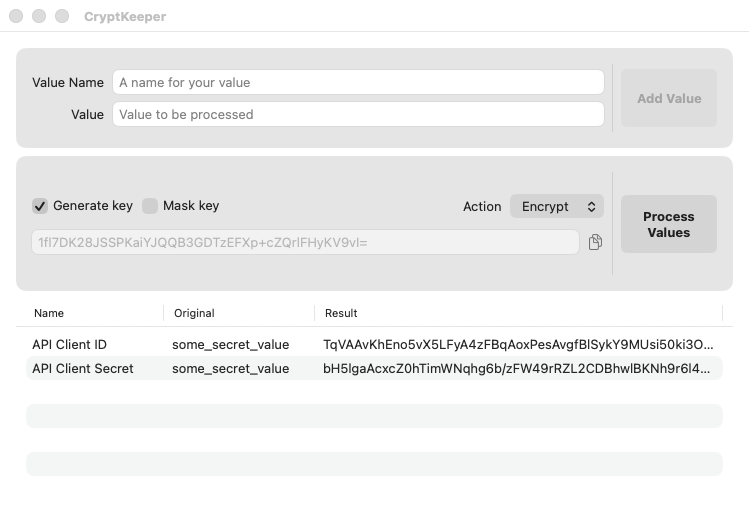
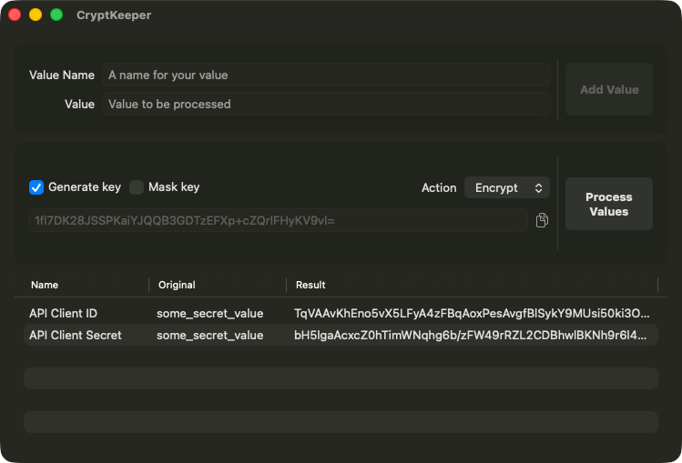

# CryptKeeper

CryptKeeper is a lightweight macOS tool for quickly encrypting and decrypting arbitrary string values using **CryptoKit’s `ChaChaPoly` (ChaCha20-Poly1305)** implementation. It’s designed for day-to-day engineering and admin workflows where you need to protect secrets (API keys, client secrets, tokens, config values) without setting up heavier infrastructure.

---

## Why CryptKeeper

* You need to encrypt/decrypt short strings quickly.
* You want output that is interoperable with Swift/CryptoKit (`ChaChaPoly`) workflows.
* You occasionally need to pass a symmetric key around in scripts and want an **optional, minimal “key masking”** step to reduce accidental exposure.

---

## Features

* **Encrypt / Decrypt arbitrary strings** using **ChaCha20-Poly1305 (AEAD)** via CryptoKit `ChaChaPoly`.
* **Bring your own symmetric key** (32-byte / 256-bit key) *or* have CryptKeeper **generate a key** for you.
* **Optional key masking**:

  * Mask (and unmask) a key by XOR’ing each byte with `0xAA`.
  * Intended to reduce accidental disclosure when keys are passed through shell arguments, logs, or terminal history.
* **Batch-friendly UI workflow**:

  * Add multiple named values.
  * Process them as a group (encrypt/decrypt).
  * Copy results as needed.

---

## Output format and interoperability

CryptKeeper uses CryptoKit’s `ChaChaPoly.SealedBox` and operates on the **combined representation** (`nonce + ciphertext + tag`). The result is typically stored/transported as **Base64**.

This means values encrypted by CryptKeeper can be decrypted by Swift/CryptoKit code that:

1. Base64-decodes the string into `Data`
2. Creates a `ChaChaPoly.SealedBox(combined:)`
3. Opens it with the same symmetric key

And vice-versa.

---

## Key requirements

* **Unmasked key**: a **32-byte** symmetric key (256-bit).
* **Common transport form**: **Base64-encoded** 32-byte value.
* **Generated key**: CryptKeeper can generate a cryptographically strong random 32-byte key on your behalf.

---

## Key masking (XOR with `0xAA`)

CryptKeeper can optionally “mask” the key by XOR’ing each byte with `0xAA` before display/transport, and can reverse this operation during decryption.

### Important note

Masking via XOR is **not encryption** and **does not provide cryptographic security**. It is **obfuscation** intended to reduce *accidental* exposure (for example: pasted keys in terminal history, process lists, or logs). 

---

## Usage (macOS app)

1. **Add values**

   * Enter a **Value Name** (e.g., `API Client Secret`)
   * Enter the **Value** to be processed
   * Click **Add Value**

2. **Select an action**

   * Choose **Encrypt** or **Decrypt**

3. **Choose key behavior**

   * **Generate key** (CryptKeeper generates a new symmetric key)
   * Or provide your own key

4. **Optional: Mask key**

   * Enable **Mask key** to XOR-mask the key for display/transport
   * Enable it again (or provide the masked key) when decrypting, so CryptKeeper can unmask it

5. **Process**

   * Click **Process Values**
   * Review results in the table and copy what you need

---

## Download

You can download the latest release [here](https://github.com/manicmachine/CryptKeeper/releases/latest).

---

## Building from source

### Requirements

* macOS (for the app)
* Xcode (recent version recommended)
* Swift + CryptoKit (ships with Apple platforms)

### Steps

1. Clone the repo
2. Open the Xcode project
3. Build and run

---

## Acknowledgments

* Built on Apple’s **CryptoKit** and the **ChaCha20-Poly1305** AEAD construction.
